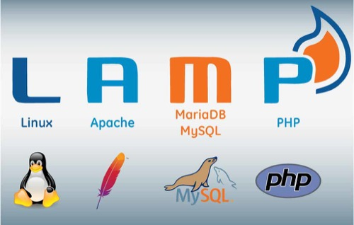
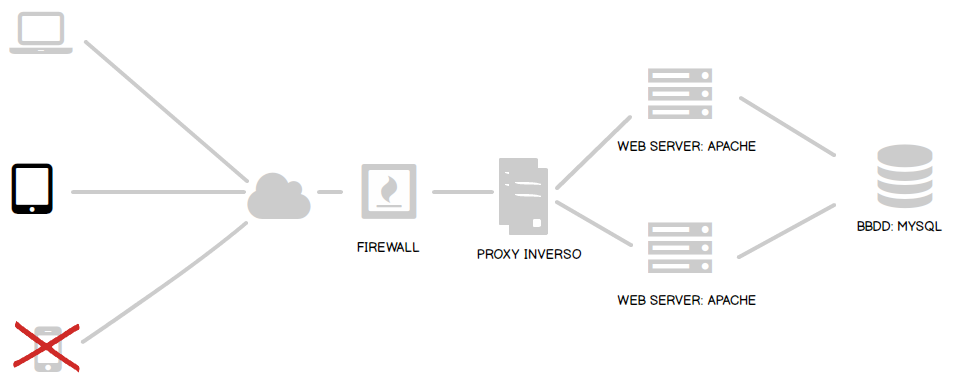
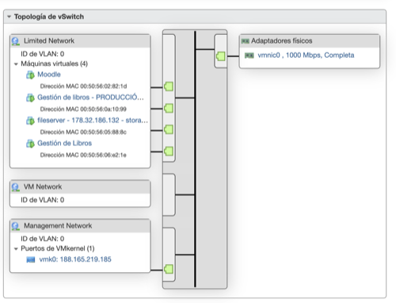
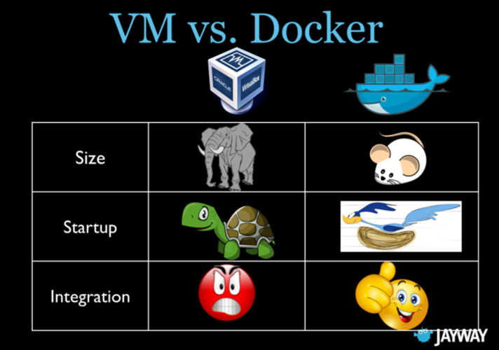
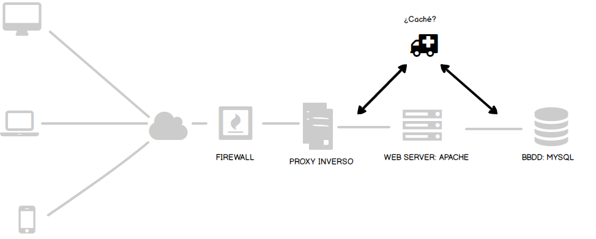
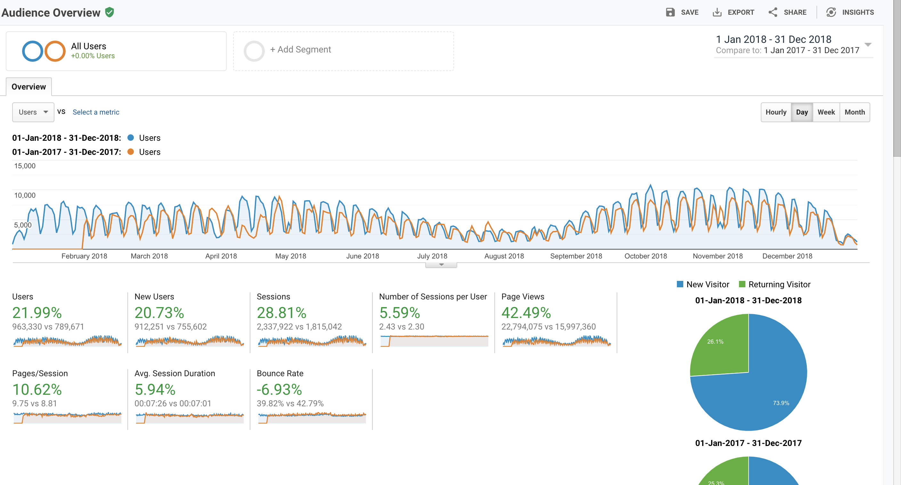
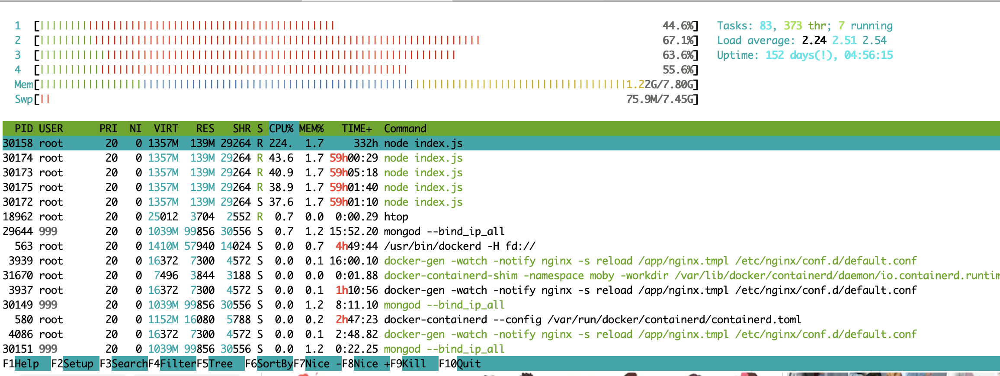
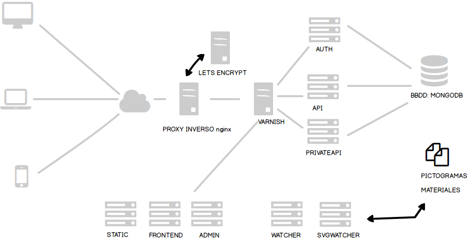

# Desarollo del nuevo portal de ARASAAC

## Tiempo estimado: 90 minutos


## Contenido

- Presentación personal
- Qué es ARASAAC
- Portal antiguo
  - Estudio nuevo desarrollo
  - Migración
- Arquitectura y desarollo de la nueva versión


## Presentación personal

- Soy físico
- Tengo casi 4 hijos
- Trabajo como profesor de Informática en el CPIFP Los Enlaces (Zaragoza)


## Qué es ARASAAC

- Documentación del equipo ARASAAC


## Portal antiguo (arasaac.org)


## Tecnologías




## Arquitectura




## Problemas

- Visualización en movil
- Aplicación monolítica
  - Uso de datos por aplicaciones de terceros
- Arasaac se "muere de éxito"
  - Escalado vertical
    - Gran consumo de CPU en frontend (gestión de imágenes)
    - Gran consumo de ancho de banda ([catálogos](http://www.arasaac.org/descargas.php))
    - Gran consumo de CPU en bbdd


- Almacenamiento de datos
  - Juego de caracteres erróneo
- Gestión de traducciones


## Soluciones


## Visualización en movil

- Es sencillo con cualquier librería de CSS actual
- ¿Y si podemos generar también aplicaciones móviles?
  - IONIC, React native...


## Consumo de datos por aplicaciones de terceros

- ¿Y si creamos una arquitectura API REST?
  - Nuestra aplicación consume la API
  - Aplicaciones de terceros también
- Necesitamos una buena documentación
  - Sería genial que se generase de forma automática


## Escalado vertical
- Pensamos en un escalado horizontal
- Uso de contenedores y algún sistema de orquestración
- Uso de virtualización vmWare (vCenter)
- Pero **no hay dinero** :-(
  - Nos quedamos con docker
  - Nos quedamos con esxi


## Limitar consumo de CPU en frontend

- ¿Y si llevamos la aplicación al cliente?
  - Angular
  - React
  - Vue
  - ...
- Con SVG en cliente se pueden hacer maravillas
- Hacemos testing de nuestra API


## Gran consumo de ancho de banda (catálogos)

- Accesos autenticados con cierto control
- Uso de ***Linux Traffic Control (TC)***


- Uso de *rsync*

```node
const rsync = new Rsync()
      .shell('ssh')
      .flags('az')
      .set('info', 'progress2') // see https://github.com/mattijs/node-rsync/issues/49
      .set('no-inc-recursive')
      .set('delete-after') // receiver deletes after transfer, not during
      .set('remove-source-files') // remove source file afterwards
      .set('bwlimit', 10000) // 10 MBytes maximum
      .source(file)
      .destination(destination)

    // Execute the command
    rsync.execute(
      (err, code, cmd) => {
        logger.debug(`COMMAND EXECUTED: ${cmd}`)
        if (err) {
          logger.error(`PUBLISHING CATALOG FAILED!: ${err}`)
          logger.debug(`RETURNED VALUE: ${code}`)
          catalogStatus[locale].error = true
          io.emit(WS_CATALOG_STATUS, catalogStatus)
          reject(err)
```


- esxi: uso de un vswitch
  



## Gran consumo de CPU en BBDD

- La aplicación tiene una lógica de negocios pequeña
- Encaja usar una base de datos NoSQL
- Nos gusta el json
- Minimizaremos el número de consultas
- Posibilidad de escalado horizontal (aunque descartado)


## Almacenamiento de datos

- Codificación 

```
def separa_campos(texto):
    '''Devuelve lista de tags. Están separados por {} en la bd
    '''
    try:
        _texto = texto.decode('utf-8')
    except:
        _texto = texto.encode('latin1').decode('utf-8')
    try:
        return [limpia(c.strip()) for c in re.findall('{(.*?)}', _texto) if c.strip()]
    except:
        logger.info('ERROR EXTRACCION TAGS: %s', texto)
        return []
```


## Gestión de traducciones

- Utilizaremos [Crowdin](https://crowdin.com/)


## Backend

- Usaremos node.js
  - Asíncrono
  - Mismo código en cliente y servidor
  - El repositorio de npm está muuuuy bien :-)

- Usaremos pyhton
  - Migración de datos
  - NLTK


##  AST

>Aragonesa de Servicios Telemáticos es una entidad de derecho público cuya misión es proporcionar servicios y soluciones de alto valor en  el ámbito de las tecnologías y servicios de la información y telecomunicaciones a la Administración de la Comunidad Autónoma de Aragón y los organismos públicos de ella dependientes.....


## AST, ¿nos dais soporte?


## Gestionamos todo :-) 

- Contratamos un servidor físico (soyoustart) para toda nuestra arquitectura


## Migración

- El desarrollo nuevo va a ser muy lento…
  - ¡No vamos a hacer un wordpress!
- La aplicación actual da problemas y AST no la quiere mantener
- AST "nos echa de sus servidores"


## Preparamos nuestro servidor

- Instalamos VMWare 
- Instalamos Debian sobre VMWare
- Instalamos docker 
- Cada máquina será un contenedor y usaremos las redes virtuales de docker


## Docker vs máquinas virtuales





## Problemas migración

- Instalación de paquetes, versiones software...
- Rendimiento
- Tuning


## Instalación de paquetes

- No era compleja :-)
- Dockerfile del servidor Apache:

```
FROM php:5.6-apache
RUN apt-get update && apt-get install -y \
        libfreetype6-dev \
        libjpeg62-turbo-dev \
        libmcrypt-dev \
        libpng-dev \
    && docker-php-ext-install -j$(nproc) iconv mcrypt \
    && docker-php-ext-configure gd --with-freetype-dir=/usr/include/ --with-jpeg-dir=/usr/include/ \
    && docker-php-ext-install -j$(nproc) gd \
    && docker-php-ext-install mysql

RUN a2enmod status

COPY config/php.ini /usr/local/etc/php/
COPY config/apache2.conf /etc/apache2/
COPY config/mpm_prefork.conf /etc/apache2/mods-available/mpm_prefork.conf
```


## Rendimiento
- Utilizamos ***siege*** o ***ab***
- Constatamos los pocos recursos que tenemos
- Ejemplo de test (100 conexiones concurrentes durante 30 segundos)

```
siege -c100 -t30s -f ./urls.txt
```


## Tuning apache

- Cambiamos *KeepAliveTimeout de 5 a 3 y posteriormente a 2
- Observamos un cambio grande

```
#
# KeepAliveTimeout: Number of seconds to wait for the next request from the
# same client on the same connection.
#
KeepAliveTimeout 2
```


## Tuning MySQL
  
- Instalamos scripts de [percona](https://www.percona.com/) para hacer mediciones
- La configuración final queda así:

```
[mysqld]
query_cache_size = 16777216
query_cache_type = 1
query_cache_limit = 1048576
max_connections = 500
```


## ¡Necesitamos caché!

- El rendimiento de la máquina no es suficiente :-(



## Configuracion de la caché

- ¿Cuánta caché podemos dar a la máquina?
- ¿Qué se cachea y qué no?
  - [Workflow complejo](https://book.varnish-software.com/4.0/_images/simplified_fsm.svg)
  - Se trabaja con VCL (Varnish cache language)
  - Purge de la caché
  - ¡Ojo con las cookies!
  - Uso de cabeceras (X-Cache-Hits, Age...)


## Monitorización

- ¿Cuánta memoria le damos a Varnish? ¿Cuánta RAM nos sobra?
- Monitorizamos con **[datadog](https://www.datadoghq.com/)**
  -  Las herramientas del tipo **htop** solo aportan instantáneas.
- Los procesadores presentan un **load average** razonable


## Aumento de tráfico

- Arasaac incrementa su uso




- Los procesadores presentan un **load average** preocupante
- Aparecen errores de varnish por timeouts


## Concepto de loadaverage





## Arquitectura y desarrollo de la nueva versión


## Arquitectura




## static, admin, frontend

- nginx para descarga de ficheros:
  -  Pictogramas, materiales...
  -  webapp del nuevo Arasaac
  -  webapp de gestión del nuevo Arasaac


## svgwatcher

- Microservicio responsable de generar los png asociados a cada pictograma (fichero svg)
- En cliente utilizamos los ficheros .png (unos pocos)
  - Se renderizan en un canvas
  - Se superponen pngs mediante la librería [konva](https://konvajs.org/)


## watcher

- Microservicio responsable de generar los materiales
- Redimensión y compresión de imágenes
- Compresión de todo el material 


## api
- Api para terceros
- Utilizamos [swagger](https://swagger.io/)
- También [Postman](https://www.getpostman.com/)


## auth
- Servidor de autenticación
- Se usará [Oauth2](https://oauth.net/2/)


## privateapi

- Uso de token para autenticación (jwt)
- Filtro por ***request.origin***


## Qué utilizamos en desarrollo cliente

- React
- Redux
  - Para el control de estado
- [Redux-saga]
  - Para configurar servicios que escuchan acciones
- Websockets


## Componentes en React

- [Material-ui](https://material-ui.com/)
  - Componentes react para implementar Material Design
- [React color](https://casesandberg.github.io/react-color/)
- Formularios
- Autocompletado
- Datagrid